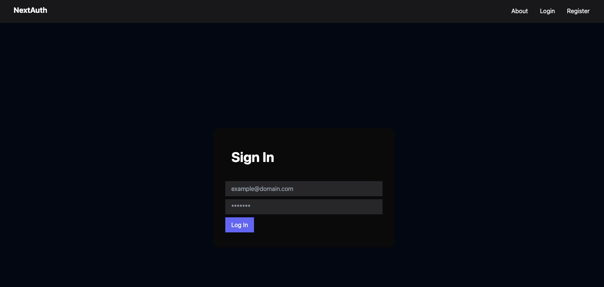

# A mini project with CRUD operatios

## Demo



## Features

- Next.js main framework
- MongoDB for storing users' data in a cloud database
- RESTful APIs architecture
- Tailwindcss for styling
- Typescrypt for strong typed code
- Next Auth for users authentication with JWT (Json Web Tokens)
- Axios for fetching data
- Bcrypt for password encryption.

## Getting Started

First, run the development server:

```bash
npm run dev
# or
yarn dev
# or
pnpm dev
```

Open [http://localhost:3000](http://localhost:3000) with your browser to see the result.
